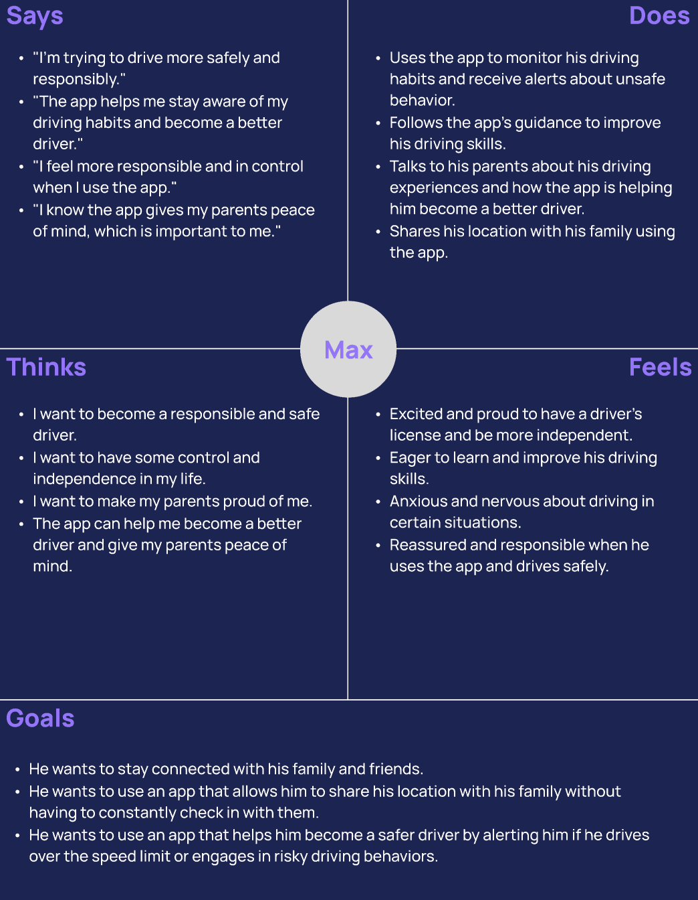

# DH110 Assignment04-Persona+Scenarios Spring2023 
### Yongsen Huang

## Introduction of the Purpose of UX Storytelling
1. UX storytelling creates emotional connections between users and products, leading to more memorable experiences.
2. Incorporating user stories into the design process helps UX designers better understand their target audience's needs and preferences, leading to more effective products.
3. UX storytelling can help identify potential usability features that can be used to refine the design and create a more user-friendly product.

## Two UX Design Tasks
1. The app allows you to track the location of registered family members on a map with accurate location markers. You can also communicate with family members through the same app.
2. The app enables you to share or track your family members' driving status, including their phone usage while driving, speeding, hard braking, emergency calling, roadside assistance, total miles driven, and more.

## Persona + Empathy Map
### Persona 1: Sarah

### Persona 2: Max

## User Scenarios and Journey Maps
### Sarah

Why Sarah is using this app?
> Sarah is a mother of two college-aged children who live far away from her. While she always wanted her kids to learn independence, she also couldn't stop worrying about them. Especially, whenever she saw news about car accidents, she would want to check in with her kids to make sure everything was going well for them. However, keeping track of her children's whereabouts and driving habits was not an easy task. That's when she discovered an app called TribeTrack. With this app, Sarah can now easily monitor her children's location and driving habits through accurate location markers and real-time updates. Not only has it given her peace of mind, but it has also helped her strike a balance between giving her children some freedom and ensuring their safety.

How Sarah is using this app?
> The app that Sarah uses is an amazing tool that helps her keep track of her kids' activities. With this app, she has set up geofence areas that notify her whenever her kids leave their apartment or school. She just need to add a registered location on the location interface, or add an circled area on the map: entering specific address or zip code will allow her to do so. This has given Sarah peace of mind, as she knows that she can keep an eye on her children's whereabouts at all times. Being a responsible mother, Sarah has made a promise to herself not to interfere with her kids' lives. However, she still wants to be aware of their driving habits, especially when they are out and about. After finishing her work and returning home, Sarah checks the app, which provides her with information on the distance her kids have driven, how long it took, and whether or not they have taken any unexpected detours. This can be done by checking the driving page that shows all family members’ driving habits. Additionally, the app also notifies Sarah if any registered family members are involved in a car accident, exceed the speed limit, or brake too hard. These notifications are an essential feature of the app, as they allow Sarah to take action quickly if necessary. Overall, this app is a valuable asset for any parent who wants to keep an eye on their children's safety and well-being.

### Max

Why Max is using this app?
> Max is a high school student who enjoys spending time with friends and staying connected with family. Recently, he obtained his driver's license and is excited to embark on this new chapter of his life. He is eager to become a responsible and safe driver, but his parents are concerned about his inexperience and worried about him driving alone. To alleviate their worries and ensure his safety on the road, Max decided to try out the location tracking and driving safety app his parents suggested.

How Max is using this app?
> Max plans to use the app to share his real-time location with family members. He can do this by turning on GPS on his phone and adding his family members to the app. While driving, the app automatically records his driving habits and location. Max can use the app to communicate with his family members, keeping them updated about his location and plans. The app allows him to share his location, send messages to his family members, and receive alerts when they arrive at their destination. If Max encounters a car accident, the app will automatically notify his family members. Alternatively, he can manually go to the driving page and click on the SOS emergency call button.

